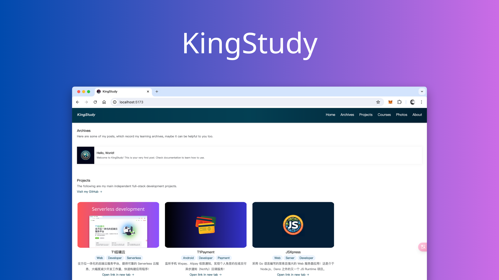

# KingStudy

这是一个无需服务器的个人主页网站系统，包含博客系统、项目展示、课程展示、照片墙展示等等功能。该网站基于 <a href="https://www.t1y.net/" target="_blank">T1 后端云</a> `Serverless` 技术构建采用 Web 技术有（ Vue3 / Vite5 / TypeScript / MongoDB / Element Plus ）。

-   <a href="./README.md">English</a>
-   <a href="https://kingstudy.vip/">预览</a>



## 使用

在使用前，您应当前往 <a href="https://www.t1y.net/" target="_blank">T1 后端云</a> 注册一个账号并创建一个应用。然后在项目根目录下创建一个 `.env` 文件，并替换以下内容：

```env
# 您的 Application ID
VITE_APP_APP_ID = '1001'
# 您的 API Key
VITE_APP_API_KEY = '***************'
# 您的 Secret Key
VITE_APP_SECRET_KEY = '***************'
# 您的T1后端云域名（生产环境下，我建议你将域名替换为你自己的域名）
VITE_APP_T1Y_API = 'https://api.t1y.net'
```

### Archives

发布一篇帖子你只需要在 T1 后端云 `archives` 集合中添加以下类型数据即可（也可以通过 `/archives/add` 进行发布）：

-   title 文章标题
-   preview 预览图地址
-   tag 标签
-   description 摘要
-   content 正文内容
-   views 浏览次数

```json
{
    "content": "Welcome to KingStudy! This is your very first post. Check documentation to learn how to use.",
    "description": "Welcome to KingStudy! This is your very first post. Check documentation to learn how to use.",
    "preview": "https://api.t1y.net/storage/1500/photos/archives/hello-world.png",
    "tag": ["Web", "Server", "Developer"],
    "title": "Hello, World!",
    "views": 73
}
```

### Projects

发布一个项目你只需要在 T1 后端云 `projects` 集合中添加以下类型数据即可：

-   title 项目名称
-   preview 预览图地址
-   tag 标签
-   description 简介
-   url 项目地址

```json
{
    "description": "采用 Go 语言编写的简易且强大的 Web 服务器应用！这是介于 Node.js、Deno 之外的又一个 JS Runtime 项目。",
    "preview": "https://api.t1y.net/storage/1500/photos/screenshot/jsxpress.png",
    "tag": ["Web", "Server", "Developer"],
    "title": "JSXpress",
    "url": "/pages/jsxpress"
}
```

### Courses

```typescript
interface Course {
    preview: string
    title: string
    tag: string[]
    url: string
    description: string
}
```

### Photos

发布一张照片你只需要在 T1 后端云 `photos` 集合中添加以下类型数据即可：

-   location 拍摄地点
-   preview 图片地址
-   title 标题

```json
{
    "location": "Yunnan",
    "preview": "https://api.t1y.net/storage/1500/photos/camera/sky.jpg",
    "title": "Sky"
}
```

## 运行

```bash
npm run dev
```

## 打包&构建

```bash
npm run build
```

## Nginx 伪静态

```nginx
location / {
	try_files $uri $uri/ /index.html;
}
```
