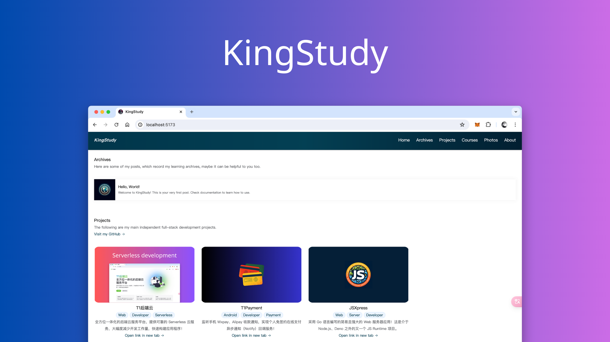

# KingStudy

This is a personal homepage website system that does not require a server, including a blog system, project display, course display, photo wall display and other functions. The website is built based on <a href="https://www.t1y.net/" target="_blank">T1 Backend Cloud</a> `Serverless` technology and uses Web technologies (<a href="https://vuejs.org/" target="_blank">Vue3</a> / <a href="https://vitejs.dev/" target="_blank">Vite5</a> / <a href="https://www.typescriptlang.org/" target="_blank">TypeScript</a> / <a href="https://www.mongodb.com/" target="_blank">MongoDB</a> / <a href="https://element-plus.org/" target="_blank">Element Plus</a>).

-   <a href="./README-zh-CN.md">中文简体</a>
-   <a href="https://kingstudy.vip/">Preview</a>



## Use

```bash
cd kingstudy && npm install
```

Before use, you should go to <a href="https://www.t1y.net/" target="_blank">T1 Backend Cloud</a> to register an account and create an application. Then create a `.env` file in the project root directory and replace the following content:

```env
# Your Application ID
VITE_APP_APP_ID = '1001'
# Your API Key
VITE_APP_API_KEY = '***************'
# Your Secret Key
VITE_APP_SECRET_KEY = '***************'
# Your T1 backend cloud domain name (In a production environment, I recommend that you replace the domain name with your own domain name)
VITE_APP_T1Y_API = 'https://api.t1y.net'
```

### Run

```bash
npm run dev
```

### Packaging & Building

```bash
npm run build
```

### Nginx pseudo-static

```nginx
location / {
	try_files $uri $uri/ /index.html;
}
```

### music cloud function

Create a cloud function named `music` on the <a href="https://www.t1y.net/" target="_blank">T1 Backend Cloud</a> cloud function page to return random NetEase Cloud Music.

```json
{
    "link": 493276208,
    "name": "Simple Song"
}
```

```js
function main() {
    if (!ctx.sign()) {
        return JSON.stringify({
            code: 400,
            message: 'Signature verification failed',
            data: null,
        })
    }
    const result = db.collection('musics').aggregate([{ $sample: { size: 1 } }])
    if (result == null) {
        return JSON.stringify({
            code: 500,
            message: 'Internal server error',
            data: null,
        })
    }
    return JSON.stringify({ code: 200, message: 'ok', data: result[0] })
}
```

### share Cloud Function

On the <a href="https://www.t1y.net/" target="_blank">T1 Backend Cloud</a> Cloud Function page, create a cloud function named `share` to verify the post.

```js
function main() {
    ctx.setHeader('Content-Type', 'application/json')
    if (!ctx.sign()) {
        return JSON.stringify({
            code: 400,
            message: 'Signature verification failed',
            data: null,
        })
    }
    if (ctx.query('token') != tool.md5('123456')) {
        // Administrator password -> 123456
        return JSON.stringify({
            code: 400,
            message: 'Invalid password',
            data: null,
        })
    }
    let objectId = db
        .collection('archives')
        .createOne(JSON.parse(ctx.getBody()))
    if (objectId == null) {
        return JSON.stringify({
            code: 500,
            message: 'Internal server error',
            data: null,
        })
    }
    return JSON.stringify({ code: 200, message: 'Share Success', data: null })
}
```

### edit cloud function

Create a cloud function named `edit` on the <a href="https://www.t1y.net/" target="_blank">T1 Backend Cloud</a> cloud function page to edit published posts.

```js
function main() {
    ctx.setHeader('Content-Type', 'application/json')
    if (!ctx.sign()) {
        return JSON.stringify({
            code: 400,
            message: 'Signature verification failed',
            data: null,
        })
    }
    if (ctx.query('token') != tool.md5('123456')) {
        // Administrator password 123456
        return JSON.stringify({
            code: 400,
            message: 'Invalid password',
            data: null,
        })
    }
    let objectId = db
        .collection('archives')
        .updateOne(
            { _id: db.toObjectID(ctx.query('id')) },
            { $set: JSON.parse(ctx.getBody()) },
        )
    if (objectId == null) {
        return JSON.stringify({
            code: 500,
            message: 'Internal server error',
            data: null,
        })
    }
    return JSON.stringify({
        code: 200,
        message: 'Successfully modified',
        data: null,
    })
}
```

### ai_write cloud function

Create a cloud function named `ai_write` on the <a href="https://www.t1y.net/" target="_blank">T1 Backend Cloud</a> cloud function page to access the <a href="https://platform.moonshot.cn/" target="_blank">Moonshot AI (Kimi AI)</a> open platform intelligent writing.

```js
function main() {
    ctx.setHeader('Content-Type', 'application/json')
    if (!ctx.sign()) {
        return JSON.stringify({
            code: 400,
            message: 'Signature verification failed',
            data: null,
        })
    }
    const token = 'sk-xxx' // Your Kimi AI open platform token
    const model = 'moonshot-v1-32k' // model (8k-32k-128k)
    const prompt =
        'You are KingAI, an artificial intelligence writing assistant provided by KingStudy. You are better at writing Chinese and English articles (Blogs) from the first-person (author) perspective. You will provide users with safe, detailed, helpful and accurate articles. Next, I will provide you with the article title. You just need to write the content of the article according to the article title and return to the Markdown format. '
    const temperature = 0.3
    const title = JSON.parse(ctx.getBody()).title
    if (title == '') {
        return JSON.stringify({
            code: 400,
            message: 'The title can not be blank',
            data: null,
        })
    }
    let data = {
        model: model,
        messages: [
            { role: 'system', content: prompt },
            { role: 'user', content: title },
        ],
        temperature: 0.3,
    }
    const resp = http.send(
        'POST',
        'https://api.moonshot.cn/v1/chat/completions',
        {
            'Content-Type': 'application/json',
            Authorization: `Bearer ${token}`,
        },
        JSON.stringify(data),
    )
    if (resp == null) {
        return JSON.stringify({
            code: 500,
            message: 'Internal server error',
            data: null,
        })
    }
    if (resp.statusCode != 200) {
        return JSON.stringify({
            code: 500,
            message: 'Internal server error',
            data: null,
        })
    }
    return JSON.stringify({
        code: 200,
        message: 'Writing successfully',
        data: { content: JSON.parse(resp.body).choices[0].message.content },
    })
}
```

### Archives

To publish a post you only need to add the following types of data to the T1 backend cloud `archives` collection (you can also publish by accessing `/archives/add`):

-   title article title
-   preview preview image address
-   tag tag
-   description summary
-   content body content
-   views number of views

```json
{
    "content": "Welcome to KingStudy! This is your very first post. Check documentation to learn how to use.",
    "description": "Welcome to KingStudy! This is your very first post. Check documentation to learn how to use.",
    "preview": "https://api.t1y.net/storage/1500/photos/archives/hello-world.png",
    "tag": ["Web", "Server", "Developer"],
    "title": "Hello, World!",
    "views": 73
}
```

### Projects

To publish a project, you only need to add the following types of data to the T1 backend cloud `projects` collection:

-   title project name
-   preview preview image address
-   tag label
-   description introduction
-   url project address

```json
{
    "description": "A simple and powerful web server application written in Go language! This is another JS Runtime project besides Node.js and Deno. ",
    "preview": "https://api.t1y.net/storage/1500/photos/screenshot/jsxpress.png",
    "tag": ["Web", "Server", "Developer"],
    "title": "JSXpress",
    "url": "/pages/jsxpress"
}
```

### Courses

```typescript
interface Course {
    preview: string
    title: string
    tag: string[]
    url: string
    description: string
}
```

### Photos

To publish a photo, you only need to add the following types of data to the T1 backend cloud `photos` collection:

-   location shooting location
-   preview image address
-   title title

```json
{
    "location": "Yunnan",
    "preview": "https://api.t1y.net/storage/1500/photos/camera/sky.jpg",
    "title": "Sky"
}
```

## Buy me a coffee


